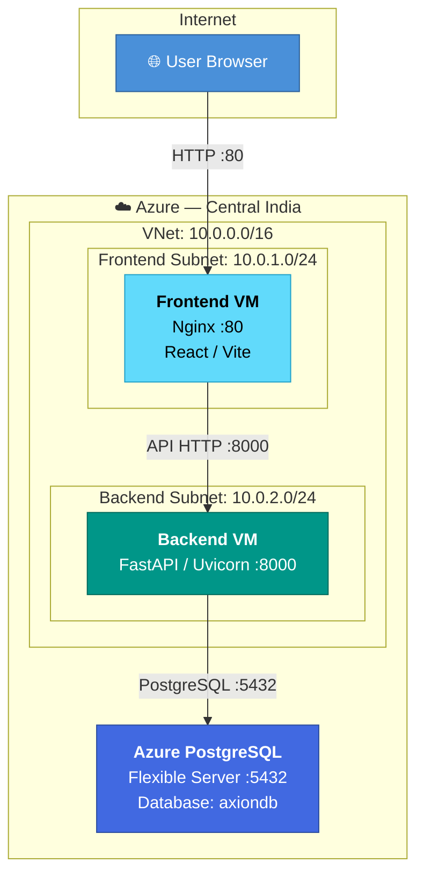
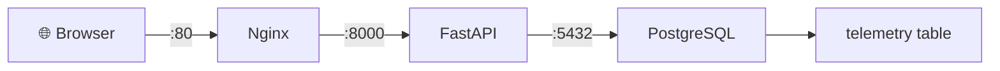

<](https://www.terraform.io/)
[](https://portal.azure.com/)
[](https://fastapi.tiangolo.com/)
[](https://react.dev/)
[](https://www.postgresql.org/)

---

</div>

## 📋 Table of Contents

- [Overview](#overview)
- [Architecture](#-architecture)
- [Prerequisites](#-prerequisites)
- [Repository Map](#-repository-map)
- [Deployment Guide](#-deployment-guide)
  - [Phase 1 — Infrastructure](#phase-1--infrastructure-provisioning)
  - [Phase 2 — Database](#phase-2--database-setup)
  - [Phase 3 — Backend](#phase-3--backend-deployment)
  - [Phase 4 — Frontend](#phase-4--frontend-deployment)
- [End-to-End Validation](#-end-to-end-validation)
- [Troubleshooting](#-troubleshooting)
- [Quick Reference Commands](#-quick-reference-commands)
- [Security Considerations](#-security-considerations)
- [Tech Stack Summary](#-tech-stack-summary)

---

## Overview

This repository contains the **Terraform infrastructure code** and step-by-step deployment guide for the **Axion Intelligence Platform** — a monolithic IoT telemetry application deployed on Microsoft Azure.

The platform ingests device telemetry (temperature, vibration, current) from industrial equipment across refinery regions and presents real-time dashboards, anomaly detection, and historical trend analysis.

### What Gets Deployed

| Layer          | Service                         | Details                        |
|----------------|----------------------------------|--------------------------------|
| Infrastructure | Azure VMs, VNet, NSGs, Public IPs | Terraform-managed              |
| Database       | Azure Database for PostgreSQL    | Flexible Server (PaaS)         |
| Backend API    | FastAPI + Uvicorn                | Python, port `8000`            |
| Frontend       | React / Vite + Nginx             | Static build served on port `80` |

---

## 🏗 Architecture



---

## ✅ Prerequisites

Before starting, ensure you have:

- [ ] **Azure Subscription** with permissions to create resources
- [ ] **Terraform** ≥ 1.x installed ([install guide](https://developer.hashicorp.com/terraform/install))
- [ ] **Azure CLI** authenticated (`az login`)
- [ ] **pgAdmin 4** installed for database management
- [ ] **SSH client** to connect to Azure VMs
- [ ] **Git** installed

---

## 🗂 Repository Map

| Repository | Purpose | Link |
|------------|---------|------|
| **Infrastructure** (this repo) | Terraform IaC for Azure resources | [axion-app-monolithic-Infra](https://github.com/shyam-codeops/axion-app-monolithic-Infra) |
| **Database Schema** | PostgreSQL table definitions | [axion-database-schema](https://github.com/devopsinsiders/axion-database-schema) |
| **Backend API** | FastAPI telemetry query service | [axion-telemetry-query-service](https://github.com/devopsinsiders/axion-telemetry-query-service) |
| **Frontend UI** | React/Vite dashboard application | [axion-ui](https://github.com/devopsinsiders/axion-ui) |

### Project Structure (This Repo)

```
axion-app-monolithic-Infra/
├── Child_Modules/                    # Reusable Terraform modules
│   ├── azurem_virtual_machine/
│   ├── azurerm_network_interface/
│   ├── azurerm_network_security_group/
│   ├── azurerm_postgresql_flexible_server/
│   ├── azurerm_public_ip/
│   ├── azurerm_resource_group/
│   ├── azurerm_subnet/
│   └── azurerm_virtual_network/
├── Environment/
│   └── Dev/                          # Dev environment configuration
│       ├── main.tf                   # Module composition
│       ├── provider.tf               # AzureRM provider config
│       ├── variables.tf              # Variable declarations
│       └── terraform.tfvars          # Variable values (sensitive!)
├── DummyData.md                      # Sample telemetry INSERT statements
└── README.md                         # This file
```

---

## 📦 Deployment Guide

### Phase 1 — Infrastructure Provisioning

#### Step 1: Clone & Initialize Terraform

```bash
git clone https://github.com/shyam-codeops/axion-app-monolithic-Infra.git
cd axion-app-monolithic-Infra/Environment/Dev
```

```bash
terraform init
terraform plan
terraform apply
```

> [!IMPORTANT]
> The `terraform.tfvars` file contains sensitive credentials. **Never commit it** to a public repository. Add it to `.gitignore` and use Azure Key Vault or environment variables in production.

#### Provisioned Resources

| Resource | Naming Convention |
|----------|-------------------|
| Resource Group | `rg-axion-dev-01` |
| Virtual Network | `vnet-axion-dev-01` (`10.0.0.0/16`) |
| Frontend Subnet | `frontend-subnet-axion-dev-01` (`10.0.1.0/24`) |
| Backend Subnet | `backend-subnet-axion-dev-01` (`10.0.2.0/24`) |
| Frontend VM | `frontend-vm-axion-dev-01` (`Standard_B2as_v2`) |
| Backend VM | `backend-vm-axion-dev-01` (`Standard_B2as_v2`) |
| PostgreSQL Server | `postgresql-axion-dev-01` (Flexible Server) |
| Database | `axiondb` |

---

### Phase 2 — Database Setup

#### Step 2: Allow Client IP on PostgreSQL Firewall

1. Open the **Azure Portal** → navigate to the PostgreSQL server
2. Go to **Networking**
3. Add your current public IP to the firewall allow-list
4. **Save** the rule

#### Step 3: Connect via pgAdmin 4

1. Open **pgAdmin 4** → Right-click **Servers** → **Register → Server**
2. Under the **Connection** tab:

   | Field     | Value                                               |
   |-----------|-----------------------------------------------------|
   | Hostname  | `postgresql-axion-dev-01.postgres.database.azure.com` |
   | Port      | `5432`                                              |
   | Database  | `axiondb`                                           |
   | Username  | *(from terraform.tfvars)*                           |
   | Password  | *(from terraform.tfvars)*                           |

3. Save — the server should now appear in the sidebar

#### Step 4: Create the Telemetry Schema

1. Clone the schema repo:
   ```bash
   git clone https://github.com/devopsinsiders/axion-database-schema.git
   ```
2. Open `02-telemetry.sql` in a text editor
3. In pgAdmin: expand `axiondb` → right-click **Tables** → **Query Tool**
4. Paste the SQL and **execute** ▶

#### Step 5: Insert Sample Telemetry Data

1. Open the [DummyData.md](./DummyData.md) file in this repository
2. In pgAdmin Query Tool, paste the `INSERT` statements and **execute** ▶
3. Verify:
   ```sql
   SELECT COUNT(*) FROM telemetry;
   -- Expected: 100 rows

   SELECT * FROM telemetry ORDER BY timestamp DESC LIMIT 5;
   ```

---

### Phase 3 — Backend Deployment

#### Step 6: SSH into Backend VM

```bash
ssh <username>@<BACKEND-PUBLIC-IP>
```

#### Step 7: Clone & Set Up the Backend

```bash
git clone https://github.com/devopsinsiders/axion-telemetry-query-service.git
cd axion-telemetry-query-service
```

```bash
# Install Python venv support
sudo apt update && sudo apt install -y python3.12-venv

# Create & activate virtual environment
python3 -m venv venv
source venv/bin/activate        # Linux
# venv\Scripts\activate         # Windows (if applicable)

# Install dependencies
pip install -r requirements.txt
```

#### Step 8: Configure Database Connection

```bash
nano config.py
```

Set the PostgreSQL connection string:

```
postgresql://<username>:<password>@<postgresql-endpoint>:5432/axiondb
```

> [!WARNING]
> If the password contains `@`, URL-encode it as `%40`.
> Example: `Nested@1234` → `Nested%401234`

Verify the config:
```bash
cat config.py
```

#### Step 9: Allow Backend VM IP on PostgreSQL Firewall

In Azure Portal → PostgreSQL → **Networking** → add the **Backend VM's public IP** → **Save**

#### Step 10: Open Backend Port 8000

Add an **inbound NSG rule** on the Backend VM:

| Field     | Value     |
|-----------|-----------|
| Direction | Inbound   |
| Protocol  | TCP       |
| Port      | 8000      |
| Action    | Allow     |

> [!TIP]
> For production, restrict the **Source** to the Frontend VM IP instead of `*` (any).

#### Step 11: Start the Backend

```bash
uvicorn main:app --host 0.0.0.0 --port 8000
```

#### Step 12: Verify the Backend API

| Check | Command / URL |
|-------|---------------|
| Swagger UI | `http://<BACKEND-PUBLIC-IP>:8000/docs` |
| ReDoc | `http://<BACKEND-PUBLIC-IP>:8000/redoc` |
| Devices | `curl http://<BACKEND-PUBLIC-IP>:8000/devices` |
| Dashboard | `curl http://<BACKEND-PUBLIC-IP>:8000/dashboard/summary` |

<details>
<summary>📡 Available API Endpoints</summary>

```
GET /dashboard/summary
GET /devices
GET /devices/{device_id}/latest
GET /devices/{device_id}/trends
GET /devices/top-anomalous
GET /dashboard/throughput
GET /dashboard/regions
```

</details>

> [!NOTE]
> A `404` at `/` is normal — FastAPI doesn't define a root route. Use `/docs` to confirm the service is running.

---

### Phase 4 — Frontend Deployment

#### Step 13: SSH into Frontend VM

```bash
ssh ssadmin@<FRONTEND-PUBLIC-IP>
```

#### Step 14: Clone the Frontend

```bash
git clone https://github.com/devopsinsiders/axion-ui.git
cd axion-ui
```

#### Step 15: Install Node.js 22

```bash
curl -fsSL https://deb.nodesource.com/setup_22.x | sudo -E bash -
sudo apt install -y nodejs
```

Verify:
```bash
node -v   # v22.x.x
npm -v
```

#### Step 16: Install Dependencies

```bash
npm install
```

> [!CAUTION]
> Do **not** run `npm audit fix` unless dependency changes have been reviewed and tested.

#### Step 17: Configure Backend API URL

> This must be done **before** building the frontend.

Find and replace the API base URL:

```bash
# Check current API URL
grep -Rni "api.axionsystems.de" src/

# Replace with backend VM IP
sed -i 's|https://api.axionsystems.de|http://<BACKEND-PUBLIC-IP>:8000|g' \
  src/App.tsx \
  src/components/pages/DashboardView.tsx \
  src/components/pages/HistoricalTrends.tsx

# Verify replacement
grep -Rni "<BACKEND-PUBLIC-IP>" src/
```

> [!IMPORTANT]
> Always include port `8000` in the URL.
> - ✅ `http://<BACKEND-PUBLIC-IP>:8000`
> - ❌ `http://<BACKEND-PUBLIC-IP>` ← will not work

#### Step 18: Build & Deploy to Nginx

```bash
# Build the frontend
npm run build

# Verify the build contains the correct API URL
grep -Rqs "<BACKEND-PUBLIC-IP>:8000" dist/ \
  && echo "✅ CORRECT API FOUND" \
  || echo "❌ API NOT FOUND — rebuild required"

# Install Nginx
sudo apt update && sudo apt install -y nginx

# Deploy
sudo rm -rf /var/www/html/*
sudo cp -r dist/* /var/www/html/

# Enable & start Nginx
sudo systemctl enable --now nginx
sudo systemctl reload nginx
```

#### Step 19: Open Frontend Port 80

Add an **inbound NSG rule** on the Frontend VM:

| Field     | Value     |
|-----------|-----------|
| Direction | Inbound   |
| Protocol  | TCP       |
| Port      | 80        |
| Source    | Internet  |
| Action    | Allow     |

#### Step 20: Verify Nginx Locally

```bash
curl -I http://localhost
# Expected: HTTP/1.1 200 OK
```

---

## 🧪 End-to-End Validation

Once all components are deployed, validate the full data flow:



### Validation Checklist

| Layer      | Test | Expected Result |
|------------|------|-----------------|
| **Database** | `SELECT COUNT(*) FROM telemetry;` | Row count > 0 |
| **Backend** | `curl http://<BACKEND-PUBLIC-IP>:8000/docs` | HTTP 200, Swagger UI |
| **Backend API** | `curl http://<BACKEND-PUBLIC-IP>:8000/devices` | JSON device list |
| **Frontend (local)** | `curl -I http://localhost` (on Frontend VM) | HTTP 200 |
| **Frontend (browser)** | Open `http://<FRONTEND-PUBLIC-IP>` | Axion login page |

### Post-Login Verification

After logging in, confirm these modules load correctly:

- ✅ Dashboard with live telemetry
- ✅ Asset hierarchy
- ✅ Historical trends
- ✅ System topology
- ✅ Alarms & events
- ✅ Telemetry throughput
- ✅ Device data

---

## 🔧 Troubleshooting

<details>
<summary><b>Frontend loads but no telemetry data appears</b></summary>

**Root Cause:** The compiled frontend build contains an incorrect API URL.

```bash
# Check the compiled build
grep -Rqs "<BACKEND-PUBLIC-IP>:8000" dist/ \
  && echo "✅ API FOUND" \
  || echo "❌ API NOT FOUND"

# If not found, fix the source and rebuild
grep -Rni "API_BASE" src/
sed -i 's|OLD_URL|http://<BACKEND-PUBLIC-IP>:8000|g' src/App.tsx src/components/pages/DashboardView.tsx src/components/pages/HistoricalTrends.tsx

npm run build
sudo rm -rf /var/www/html/*
sudo cp -r dist/* /var/www/html/
sudo systemctl reload nginx
```

Then hard-refresh the browser: **Ctrl + F5**

</details>

<details>
<summary><b>Backend cannot be reached from the browser</b></summary>

```bash
# Check if Uvicorn is listening
sudo ss -lntp | grep 8000
# Should show: 0.0.0.0:8000

# Test from the backend VM itself
curl -i http://localhost:8000/docs
```

If Uvicorn is running but the browser can't connect:
- Verify the Azure NSG allows **TCP 8000 inbound**
- Ensure Uvicorn was started with `--host 0.0.0.0` (not `127.0.0.1`)

</details>

<details>
<summary><b>Backend cannot connect to PostgreSQL</b></summary>

Verify all of the following:

| Check | Expected |
|-------|----------|
| PostgreSQL firewall allows Backend VM IP | ✅ |
| Hostname in `config.py` | `postgresql-axion-dev-01.postgres.database.azure.com` |
| Database name | `axiondb` |
| Port | `5432` |
| Credentials correct | ✅ |
| `@` in password encoded as `%40` | ✅ |

</details>

<details>
<summary><b><code>/</code> returns 404 from FastAPI</b></summary>

This is **expected behavior**. FastAPI doesn't define a root route.

```bash
# This returns 404 — NORMAL
curl -i http://<BACKEND-PUBLIC-IP>:8000/

# This should return 200 — verifies the service works
curl -i http://<BACKEND-PUBLIC-IP>:8000/docs
```

Test the actual API endpoints listed in the Swagger documentation instead.

</details>

---

## 📌 Quick Reference Commands

### Frontend VM

```bash
# Check Nginx status
sudo systemctl status nginx

# Reload Nginx after redeploying
sudo systemctl reload nginx

# Test Nginx locally
curl -I http://localhost

# Check compiled API URL
grep -Rqs "<BACKEND-PUBLIC-IP>:8000" dist/ && echo "OK" || echo "MISSING"

# Full redeploy
npm run build && sudo rm -rf /var/www/html/* && sudo cp -r dist/* /var/www/html/ && sudo systemctl reload nginx
```

### Backend VM

```bash
# Start the API server
uvicorn main:app --host 0.0.0.0 --port 8000

# Check if the server is listening
sudo ss -lntp | grep 8000

# Test the API
curl -i http://localhost:8000/docs
curl http://localhost:8000/devices
```

### Database (pgAdmin)

```sql
-- Row count
SELECT COUNT(*) FROM telemetry;

-- Latest records
SELECT * FROM telemetry ORDER BY timestamp DESC LIMIT 20;
```

---

## 🔒 Security Considerations

> [!WARNING]
> This deployment is designed for **development / learning purposes**. For production, address the following:

| Area | Recommendation |
|------|----------------|
| **HTTPS** | Enable TLS on both frontend (Nginx) and backend (reverse proxy) |
| **API Exposure** | Reverse-proxy the backend through Nginx; don't expose port `8000` publicly |
| **Secrets Management** | Use Azure Key Vault or environment variables instead of hardcoded credentials |
| **NSG Rules** | Restrict source IPs instead of allowing `*` (any) |
| **PostgreSQL Firewall** | Allow only required source IPs; disable public access if using VNet integration |
| **Credential Rotation** | Rotate any credentials that were exposed in documentation or screenshots |
| **Managed Identity** | Use Azure Managed Identity where supported to eliminate password-based auth |

---

## 📊 Tech Stack Summary

| Component | Technology | Port | Purpose |
|-----------|------------|------|---------|
| Infrastructure | Terraform + AzureRM `4.72.0` | — | IaC provisioning |
| Database | Azure PostgreSQL Flexible Server | `5432` | Telemetry data storage |
| Backend | Python + FastAPI + Uvicorn | `8000` | REST API for telemetry queries |
| Frontend | React + Vite (TypeScript) | — | Dashboard SPA |
| Web Server | Nginx | `80` | Serves frontend static build |
| API Docs | Swagger UI / ReDoc | `8000/docs` | Interactive API documentation |

---

<div align="center">

**Built with ❤️ by [DevOps Insiders](https://github.com/devopsinsiders)**

</div>
]]>
